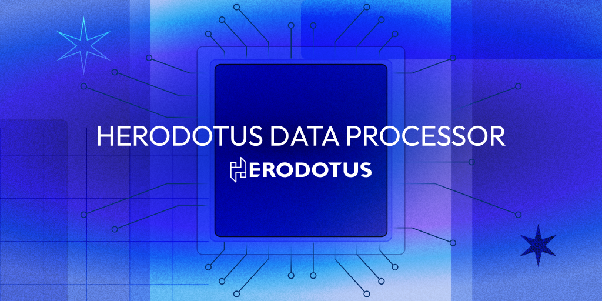

# Herodotus Data Processor (HDP)

[](https://github.com/HerodotusDev/hdp/actions/workflows/ci.yml)

> **Warning:** This codebase is experimental and not audited. Use at your own risk.

HDP enhances off-chain compute capabilities with zkVMs for verifiable on-chain data integration. For more, visit our [documentation](https://docs.herodotus.dev/herodotus-docs/developers/herodotus-data-processor-hdp).

## Introduction

The HDP CLI is designed to process human-readable requests and convert them into a format acceptable to Cairo programs. This conversion is a crucial part of the preprocessing step, which prepares data for subsequent off-chain computations in zkVM environments. The CLI not only facilitates this transformation but also offers additional features to support development and testing.

## Features

- **Development Tools**: Encode and decode data lakes and computational tasks.
- **Core Processing**: Compile data from various sources and compute aggregate functions.
- **Extensibility**: Support for multiple blockchain integrations and various ZKVM backends is planned.
- **Ease of Use**: Provides a CLI for easy interaction with the system.

## Install HDP

### Install with cargo

```bash
# Install with cargo
❯ cargo install --git https://github.com/HerodotusDev/hdp --locked --force
```

### Build from source

```bash
# clone repo
❯ git clone https://github.com/HerodotusDev/hdp.git

# install hdp
❯ cargo install --path cli -f
```

## Getting Started

To launch the interactive CLI:

```bash
# Start the HDP
❯ hdp start
Welcome to Herodotus Data Processor interactive CLI! 🛰️

                _   _   ____    ____
                | | | | |  _ \  |  _ \
                | |_| | | | | | | |_) |
                |  _  | | |_| | |  __/
                |_| |_| |____/  |_|

? Step 1. What's your datalake type?
```

### Usage Examples

Header value with `AVG`

```
hdp encode "avg" -b 4952100 4952110 "header.base_fee_per_gas" 1
```

Account value with `SUM`

```
hdp encode "sum" -b 4952100 4952110 "account.0x7f2c6f930306d3aa736b3a6c6a98f512f74036d4.nonce" 2
```

Storage value with `AVG`

```
hdp encode "avg" -b 5382810 5382820 "storage.0x75CeC1db9dCeb703200EAa6595f66885C962B920.0x0000000000000000000000000000000000000000000000000000000000000002" 1
```

Account value with `COUNT`

```
hdp encode "count" "gt.1000" -b 4952100 4952110 "account.0x7f2c6f930306d3aa736b3a6c6a98f512f74036d4.nonce" 2
```

For more detailed usage, refer to the commands below or the help documentation:

```console
❯ hdp --help
Interact Herodotus Data Processor via CLI

Usage: hdp <COMMAND>

Commands:
  start       New to the HDP CLI? Start here!
  encode      Encode the task and datalake in batched format test purposes
  decode      Decode batch tasks and datalakes
  decode-one  Decode one task and one datalake (not batched format)
  run         Run the evaluator
  help        Print this message or the help of the given subcommand(s)

Options:
  -h, --help     Print help
  -V, --version  Print version
```

## Integration Testing

Integration testing in HDP ensures that the functionality of aggregate functions such as `SUM`, `AVG`, `MIN`, `MAX`, and `COUNT` operates correctly across various numeric fields within the blockchain data structure. These functions are designed specifically for numeric data types, ensuring accurate and reliable computations.

### Testing Environment

Our integration tests utilize `script/integration.sh` to verify the correct operation of each function across the supported fields. To execute these tests locally, refer to the [Integration Test Guide](./example/readme.md) for detailed instructions.

### Supported Aggregate Functions

- **SUM, AVG, MIN, MAX, COUNT**: These functions are supported only for fields with numeric values.

### Function Support Matrix

Here is the support matrix indicating which blockchain elements are tested for each aggregate function. The matrix highlights fields where these functions are applicable.

| Field Description             | SUM | AVG | MIN | MAX | COUNT |
| ----------------------------- | --- | --- | --- | --- | ----- |
| `account.nonce`               | ✅  | ✅  | ✅  | ✅  | ✅    |
| `account.balance`             | ✅  | ✅  | ✅  | ✅  | ✅    |
| `account.storage_root`        | -   | -   | -   | -   | -     |
| `account.code_hash`           | -   | -   | -   | -   | -     |
| `storage.key` (numeric value) | ✅  | ✅  | ✅  | ✅  | ✅    |
| `storage.key` (hash value)    | -   | -   | -   | -   | -     |
| `header.difficulty`           | ✅  | ✅  | ✅  | ✅  | ✅    |
| `header.gas_limit`            | ✅  | ✅  | ✅  | ✅  | ✅    |
| `header.gas_used`             | ✅  | ✅  | ✅  | ✅  | ✅    |
| `header.timestamp`            | ✅  | ✅  | ✅  | ✅  | ✅    |
| `header.base_fee_per_gas`     | ✅  | ✅  | ✅  | ✅  | ✅    |
| `header.blob_gas_used`        | ✅  | ✅  | ✅  | ✅  | ✅    |
| `header.excess_blob_gas`      | ✅  | ✅  | ✅  | ✅  | ✅    |
| `header.nonce`                | ✅  | ✅  | ✅  | ✅  | ✅    |
| Other `header` elements       | -   | -   | -   | -   | -     |

_Note: Fields marked with "-" are not applicable for the specified aggregate functions because they do not contain numeric data or the data type is not suitable for these calculations._

### Additional Notes

- Please ensure that the data fields you are applying these functions contain numeric values to avoid computational errors.
- For details on how these tests are performed or to contribute to the further development of tests, please refer to the [Integration Test Guide](./example/readme.md).

## HDP run

```console
❯ hdp run --help
Run the evaluator

Usage: hdp run [OPTIONS] [TASKS] [DATALAKES] [RPC_URL] [CHAIN_ID]

Arguments:
  [TASKS]      Batched tasks bytes
  [DATALAKES]  Batched datalakes bytes
  [RPC_URL]    The RPC URL to fetch the data
  [CHAIN_ID]   The chain id to fetch the data

Options:
  -o, --output-file <OUTPUT_FILE>  Path to the file to save the output result
  -c, --cairo-input <CAIRO_INPUT>  Path to the file to save the input.json in cairo format
  -h, --help                       Print help
```

Support passing argument as env variable or as arguments.

```bash
# pro tip: run herodotus data processing with `.env`
hdp run

# run herodotus data processing
hdp run ${Encoded Task} ${Encoded Datalake} ${Input your RPC Provider -- this example is Etherum Sepolia} ${Input Chain ID that you are target on}
```

## Development

```sh
# CI check
cargo clippy --all --all-targets -- -D warnings && cargo fmt -- --check && cargo test --all --all-targets -- --nocapture
```

## Defining Your Own Module

For developers interested in extending the functionality of HDP by adding new modules, follow the steps outlined below. This guide assumes a basic understanding of Rust and its module system.

### Getting Started

1. **Module Location**: Start by creating a new module within the `aggregate_fn` directory. You can find this at [aggregation_fn/mod.rs](./crates/core/src/aggregate_fn).

2. **Define Enum**: Define your new function as an enum in the [file](./crates/core/src/aggregate_fn). Make sure to add match arms for the new enum variants in the implementation.

3. **Handle Data Types**: Depending on the expected input type for your function:
   - **Integer Inputs**: Use [`U256`](https://docs.rs/alloy-primitives/latest/alloy_primitives/index.html#reexport.U256) for handling large integers compatible with Ethereum's numeric constraints.
   - **String Inputs**: Use Rust's standard `String` type for text data.

### Integration with Existing Functions

For a practical example of how to integrate context-sensitive operations, refer to the implementation of the [`COUNT`](./core/src/aggregate_fn/integer.rs#L118) function. This example shows how to pass and utilize additional context for operations, which can be particularly useful for conditional processing or complex calculations.

### Testing Your Module

After implementing your new function, it's crucial to verify its functionality:

- **Create Unit Tests**: Add tests in the corresponding test file in the `tests` directory. Ensure your tests cover all new logic to maintain stability and reliability.
- **Test for Integer Types**: Pay special attention to functions that handle integer types, ensuring they correctly process and output values fitting within a `bytes32` length, reflecting Ethereum's data type constraints.

## License

`hdp` is licensed under the [GNU General Public License v3.0](./LICENSE).

---

Herodotus Dev Ltd - 2024
