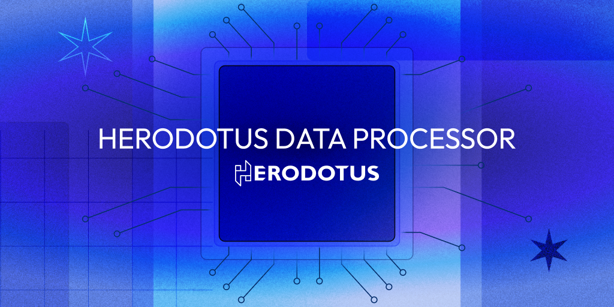

# Herodotus Data Processor (HDP)

[](https://github.com/HerodotusDev/hdp/actions/workflows/ci.yml)
[![Crates.io][crates-badge]][crates-url]
[![Documentation][docs-badge]][docs-url]
[![GPLv3 licensed][gpl3-badge]][gpl3-url]

[crates-url]: https://crates.io/crates/hdp
[crates-badge]: https://img.shields.io/crates/v/hdp.svg
[docs-badge]: https://docs.rs/hdp/badge.svg
[docs-url]: https://docs.rs/hdp
[gpl3-badge]: https://img.shields.io/badge/license-GPLv3-blue
[gpl3-url]: LICENSE

> **Warning:** This codebase is experimental and not audited. Use at your own risk.

HDP enhances off-chain compute capabilities with zkVMs for verifiable on-chain data integration. For more, visit our [documentation](https://docs.herodotus.dev/herodotus-docs/developers/herodotus-data-processor-hdp).

## Introduction

The Data Processor CLI serves as an essential tool for developers working with Cairo programs and zkVM environments. Its primary function is to translate human-readable requests into a format compatible with Cairo programs, enabling commands to be executed over the Cairo VM and generating executable outputs. This transformation is a crucial preprocessing step that prepares data for off-chain computations in zkVM environments.

## Features

- **Development Tools**: Encode and decode data lakes and computational tasks.
- **Core Processing**: Compile data from various sources and compute aggregate functions.
- **Extensibility**: Support for multiple blockchain integrations and various ZKVM backends is planned.
- **Ease of Use**: Provides a CLI for easy interaction with the system.

## Install HDP

### Install with cargo

```bash
# Install with cargo
❯ cargo install --git https://github.com/HerodotusDev/hdp/ --tag {TAG} --locked --force hdp-cli
```

### Build from source

```bash
# clone repo
❯ git clone https://github.com/HerodotusDev/hdp.git

# install hdp
❯ cargo install --locked -f --path  cli/
```

## Getting Started

To launch the interactive CLI:

```bash
# Start the HDP
❯ hdp start
Welcome to Herodotus Data Processor interactive CLI! 🛰️

                _   _   ____    ____
                | | | | |  _ \  |  _ \
                | |_| | | | | | | |_) |
                |  _  | | |_| | |  __/
                |_| |_| |____/  |_|

? Step 1. What's your datalake type?
```

## Usage Examples

First locate `.env` file like the one in [example](./.env.example).

Second, run command like below :

note that this will go though both pre-process -> process step.

```bash
hdp run -r ${Request file path} -p ${Program input file path} -b ${Batch proof file path} -c ${PIE file after process}
```

For a more comprehensive guide on commands available on `hdp run`:

```console
❯ hdp run --help
Run batch of tasks base on request json file

Usage: hdp run [OPTIONS] --request-file <REQUEST_FILE> --program-input-file <PROGRAM_INPUT_FILE>

Options:
  -r, --request-file <REQUEST_FILE>
          Pass request as json file
      --dry-run-cairo-file <DRY_RUN_CAIRO_FILE>
          dry run contract bootloader program. only used for module task
  -p, --program-input-file <PROGRAM_INPUT_FILE>
          Path to save program input file after pre-processing
      --cairo-format
          Set this boolean to true to generate cairo format program_input_file
  -b, --batch-proof-file <BATCH_PROOF_FILE>
          Path to save batch proof file after pre-processing
      --sound-run-cairo-file <SOUND_RUN_CAIRO_FILE>
          hdp cairo compiled program. main entry point
  -c, --cairo-pie-file <CAIRO_PIE_FILE>
          Path to save pie file
      --proof-mode
          Flag to run `cairo-run` in proof mode
  -h, --help
          Print help (see more with '--help')
```


### Integration Test

The core soundness of HDP relies on generating the correct input file and running the Cairo program. To ensure this, a full integration test flow is necessary to link the pre-processor and processor versions. For continuous integration tests, please refer to the [hdp-test](https://github.com/HerodotusDev/hdp-test) repository as it contains all the cases of supported features in table below.


### Additional Notes

- Please ensure that the data fields you are applying these functions contain numeric values to avoid computational errors.
- For details on how these tests are performed or to contribute to the further development of tests, please refer to the [Integration Test Guide](https://github.com/HerodotusDev/hdp-test).

## Development

```sh
# CI check
just run-ci-flow
```

### Local Run

Full local environment to run, check out this [hdp module template](https://github.com/HerodotusDev/hdp-module-template).

## License

`hdp` is licensed under the [GNU General Public License v3.0](./LICENSE).

---

Herodotus Dev Ltd - 2024
