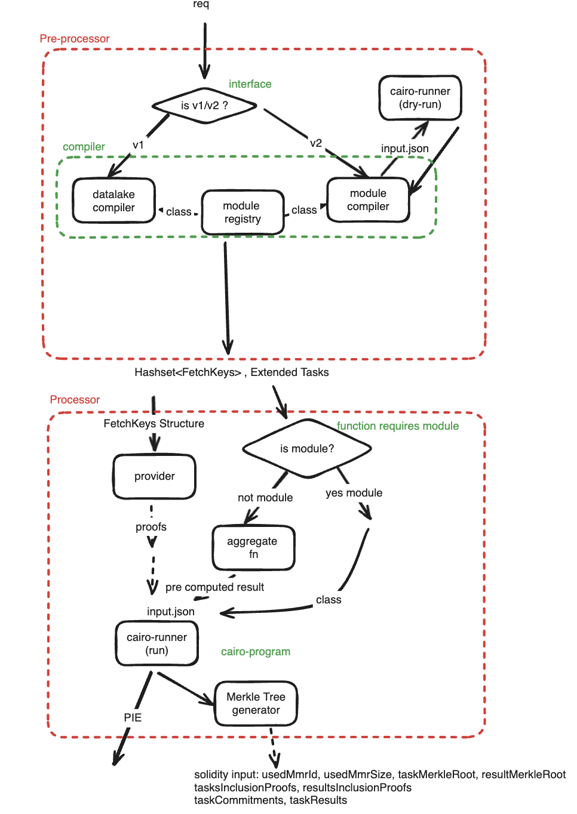

# Data Processor Core

## Compiler

Compiler is responsible to turn request into `HashSet<FetchKeyEnvelope>` format and extended request format so that processor can perform it's job easily and generic way regardless of the interface.
